# Cursive Transformer

_Note (July 5, 2024): this repo is under active development and thus subject to rapid breaking changes._

## Quickstart

* `git clone https://github.com/greydanus/cursivetransformer.git`
* `cd cursivetransformer`
* `pip install -r requirements.txt`
* `python train.py`

## Making a dataset

Let's construct a dataset of cursive pen strokes for training a handwriting model. We don't have an e-pen or any special hardware. Also, someday we want to allow people to clone their own handwriting in a demo. Thus we will use a strictly trackpad/mouse-based interface. This interface is defined in the self-contained `collect.html` which is a simple webpage that allows users to enter handwriting samples. It can prompt them with words from a word bank if desired. When they are finished entering samples, they can export the result to a JSON file. We experimented with a couple different approaches to dataset generation (tracing from pictures of cursive, writing multiple words at once, writing single words and then later stitching them together...) so this interface supports them all.

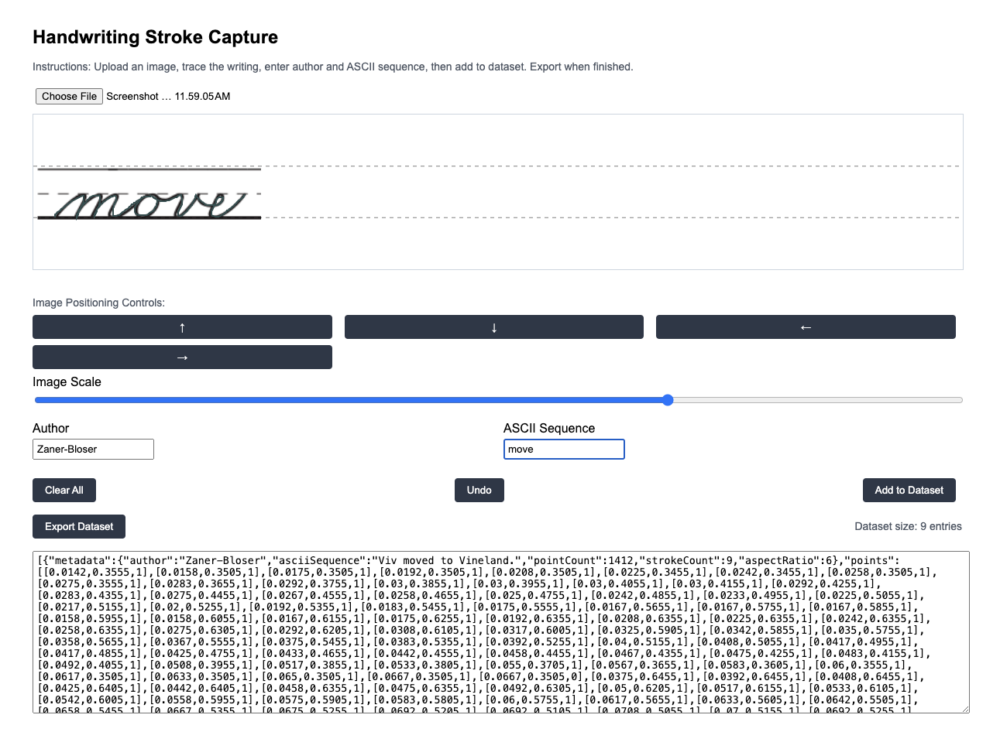

## Preprocessing and Tokenization

Our raw dataset consists of a large JSON file containing many examples of handwriting. Each example is a JSON dictionary containing a 'points' variable that is a list of (`x`, `y`, `is_pen_down`) tuples. This dictionary also has a 'metadata' section which includes the ASCII annotations, the author name, and some other information. Our first preprocessing step is to convert the pen stroke coordinates from absolute coordinates to offsets. This is a much better representation for training a generative model. Next, we compute unit vectors and magnitudes for each of these offsets, so as to decouple magnitude from direction. This permits a more compact tokenization, and is also a better representation for training a generative model. Now our stroke offsets are represented by 4-tuples of (`unit_dx`, `unit_dy`, `magnitude`, and `is_pen_down`).

**Tokenization scheme.** The next step is to tokenize these offsets. We do this by introducing separate lookup tables for `unit_dx`, `unit_dy`, and _a combination of `magnitude` + `is_pen_down`_. Thus token numbers 0-N1 indicate a particular value for `unit_dx`, token numbers N1-N2 represent a particular value for `unit_dy`, and token numbers N2-N3 represent a particular configuration of `magnitude` and `is_pen_down`. This means that a tuple of three tokens, eg (35, 106, 142) is sufficient for representing one stroke offset. This means, for example, that a handwriting sample of 250 points could be converted to 250 * 3 = 750 tokens. We need 30-40 pen strokes to represent one character, so an example containing 18 characters like the one below ("actor mass afford zoo") would in theory require around 35 * 18 = 630 stroke offsets and thus 630 * 3 = 1890 tokens. What we see in the image below is that for this particular case we actually needed just 537 strokes, which would correspond to 1611 tokens. The token sequence was padded out to 3000 tokens, which is why "Encoded stroke shape" is 3000 in the example.

One might suggest using polar coordinates of the form (`theta`, `magnitude`, and `is_pen_down`). This would appear to be strictly better, since it reduces the context window by 33% (!). We tried this version of the tokenizer and got strictly worse results (see the **Samples July 8** section further down).

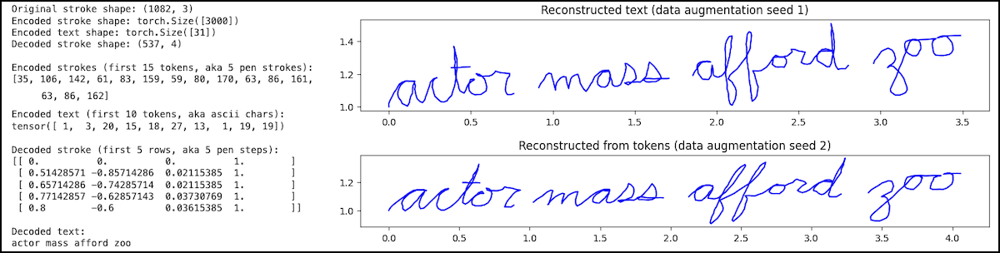

Now that we have tokens that look just like those used for language modeling, we can use boilerplate LLM Transformer code from hereon out.

## Training and logging

We use a Transformer architecture taken from Karpathy's [`makemore`](https://github.com/karpathy/makemore/blob/master/makemore.py) repo. This, is basically the GPT-2/GPT-3 architecture plus a few judicious simplifications (eg, slightly different GELU). We add cross-attention to this architecture in order to condition on the ASCII context information. As for training code, we again start from the [`makemore`](https://github.com/karpathy/makemore/blob/master/makemore.py) repo but add Weights and Biases for logging and sample visualization.

**A quick ode to Weights and Biases.** One of the challenges of debugging this kind of model is that you need to look at the samples pretty frequently in order to determine what the model is learning and what failure modes are occurring. I've really enjoyed using W&B for this because visualizing samples (as images) while training in the same notebook is not trivial. You need to run two separate threads, and on top of that it's just not what notebooks are designed for. By comparison, W&B makes this easy and extremely fast. I've noticed that images of sample handwriting are ready to view on W&B within a second or two of when they are generated on my A100 Colab GPU. That's pretty impressive! W&B also makes it easy to run ablation studies, as loss stats from different runs (but the same project) are by default aggregated in the same plot. This has been of great practical use when doing mini-experiments to determine how to set data augmentation parameters and other modeling parameters. We run four models on four different A100s (one ablation setting on each) and compare their stats on W&B in real time.

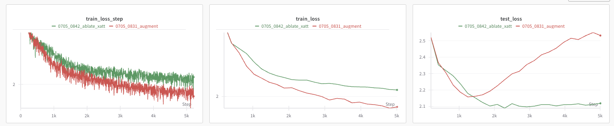

### Samples July 5

_The samples shown here were generated by conditioning on ASCII characters from the test set examples. They provide some indication that the ASCII information is able to effectively condition what the model generates via cross-attention. You'll notice that the model garbles some characters and often generates them out of order. It has not yet truly solved the task. However, I'm pleased to have gotten this far with a train/test set of 330/36 examples (!) and a bit of data augmentation._

### Samples July 6

_We decided to draw out one word at a time and then computationally stitch them together to create combinatorially many 3-word sequences. Thus from a few hundred words we were able to bootstap a dataset of tens of thousands of examples._

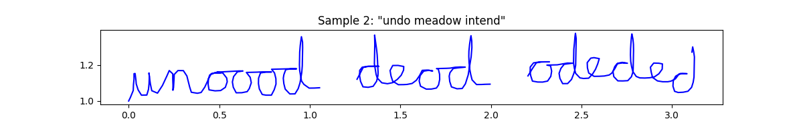

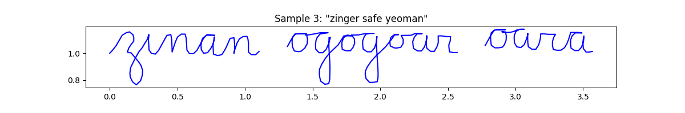

_**Fixing cross attention.** We found a critical bug in my cross-attention implementation: no positional embedding was being added to the token embedding. Sample quality improved spectacularly after this fix. A few other less spectacular changes happened, principal among them being to accelerate training by increasing the learning rate by a factor of ten._

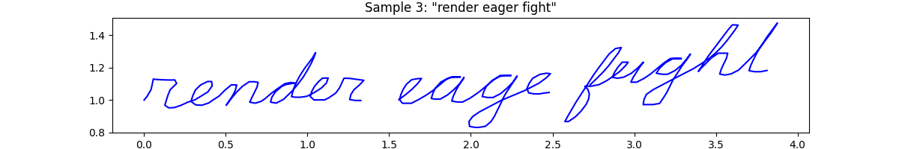

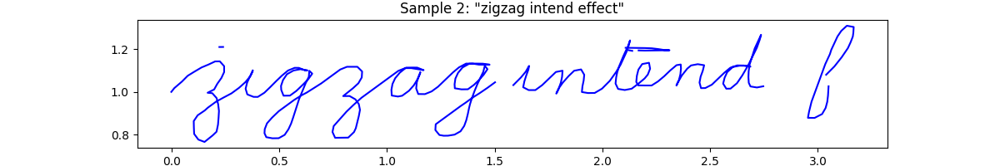

_Training on a 10x larger (combinatorially generated) dataset further improves performance._

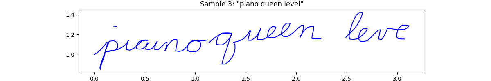

### Samples July 8

**Upgrading the tokenizer.** The previous tokenizer was a bit irrational. We were representing stroke offsets with 4-tuples of the form (`unit_dx`, `unit_dy`, `magnitude`, and `is_pen_down`). Now, what we failed to see at the time is that the first two values can be rolled into one `theta` parameter and we are then working in polar coordinates. This reduces the context window needed to represent a given example by a third. We made this fix, adjusted the augmentations to operate on polar coordinates, and increased the context window from 1.1k to 1.3k so as to reliably capture all three words in the combinatorially generated stroke dataset. Had some trouble getting on a Colab A100, but eventually were able to launch a new training run.

Quite surprisingly, this led to significantly worse samples, to the point where we are likely going to have to revert to the old tokenizer

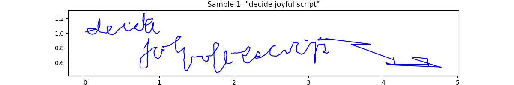

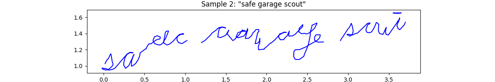

### Samples July 14

**Bigbank dataset.** After reverting to the (`unit_dx`, `unit_dy`, `magnitude`, and `is_pen_down`) coordinates system, we increased the raw dataset size to 1197 words (46 words per letter of the alphabet). Retraining using more or less the same code as used on July 6 gives attractive cursive without any misspellings.

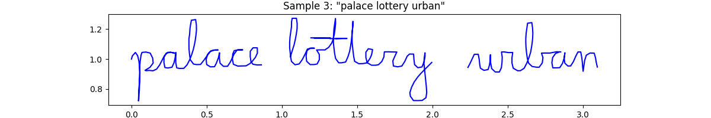

**Cross attention ablation.** For fun we did a quick ablation where we zeroed out the vectors representing the ASCII inputs before they are passed to the cross attention layer. As one might expect, we get nice cursive letters that do not spell much of anything.

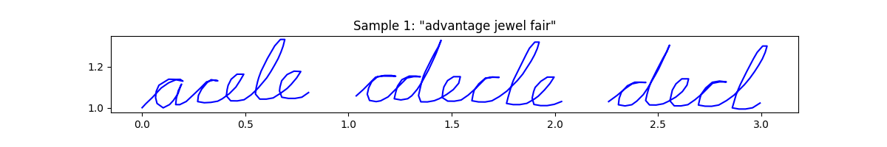

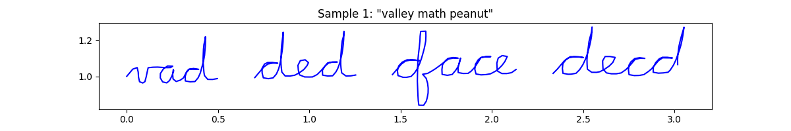

### Samples July 17

**Polar coordinates.** We made a second attempt at changing the tokenizer so as to use polar coordinates. This time we were successful: we now represent every stroke offset with two tokens rather than three, leading to much smaller window sizes. We ran the latest runs on a model that was 33% smaller and faster overall. NOTE: it's substantially better to represent these stroke offsets as (`theta`, `radius_and_is_pen_down`) instead of (`radius_and_is_pen_down`, `theta`). Intuitively, you want to "point and then shoot" the pen in its next direction, rather than "shoot and then point."

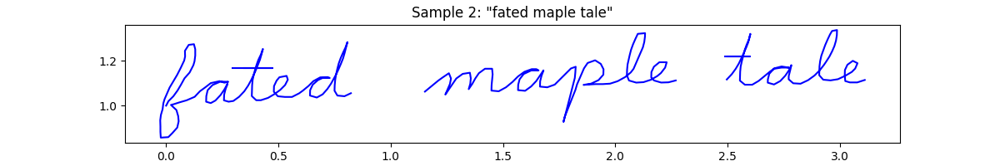

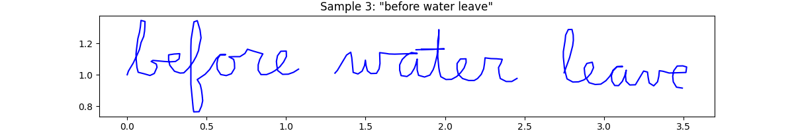

### Progress July 19

**Print handwriting dataset.** In the interest of training a model capable of learning multiple styles, we began constructing a second dataset, this one consisting entirely of print training examples. Several training examples are shown below.

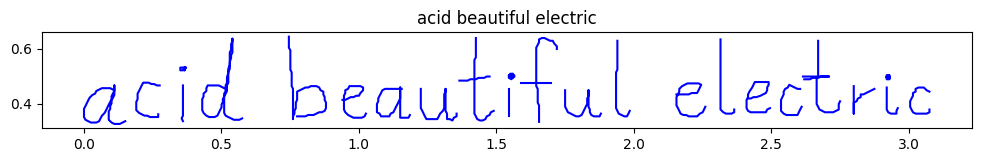

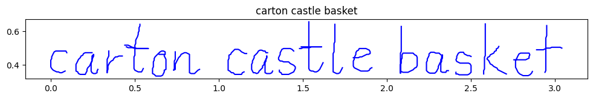

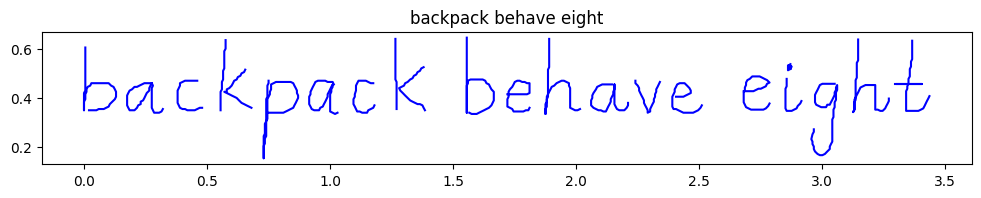

### Progress July 23

**Print handwriting dataset.** Print dataset is finished and preliminary model training runs look good. Model misspelled "satellite" in this test example but aside from that has rather good penmanship:

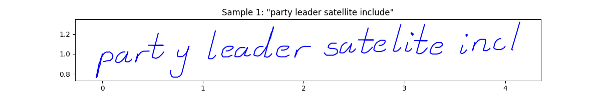

This sample is taken from early training. It's not the model's best, but it looks interesting:

### Progress July 24

**Better model.** We increased the dataset to 500k examples including both print and cursive examples. We trained for 50k steps on an A100 instead of 30k on an L4. Then we experimented with a learning rate schedule but it appeared best to use a large constant learning rate (1e-2). We doubled the context window to 1500 tokens. Test set samples:

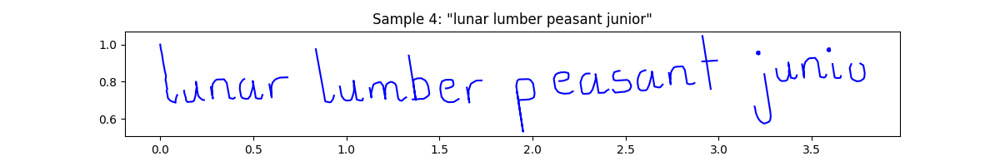

### Progress August 5

**Compare cartesian and polar tokenizers.** For some time we have been unsure of which is better: using a cartesian or polar representation of pen offsets. After some time away from this project, we solved a pernicious bug in the cartesian tokenizer and was able to do a side-by-side comparison. At the time of writing, both runs were in progress and the sample quality of the model using the polar tokenizer seemed a bit better. This is good news because the polar representation also uses three tokens per stroke rather than four, thus it permits a 33% longer context window. We will let the models train to completion before making a final call.

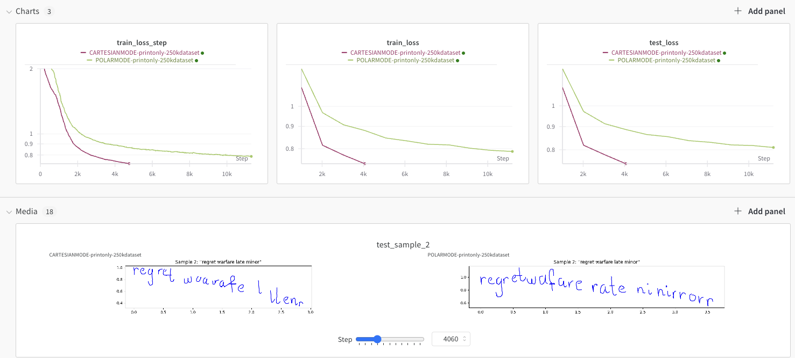

Getting some weird artifacts in the final trained polar model. Besides that the polar model looks much better. Here are two test samples.

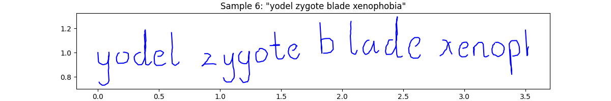

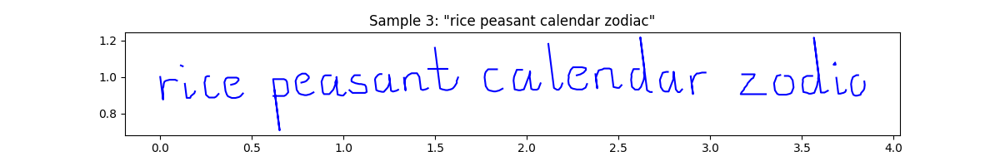

### Progress August 8-9

Spent some time looking for other (larger) datasets to train and debug on. IAM was not sending emails to my account so I was unable to access its online stroke dataset, which is the most commonly used one. [Here is a more recent dataset](https://github.com/brownvc/decoupled-style-descriptors?tab=readme-ov-file#brush-dataset) that looks promising.

### Progress August 11-12

Changed data formatting to use zipped pickle files, following the BRUSH format. Wrote some code for loading BRUSH data into the format needed for training. Performed training on the full BRUSH dataset (27,000 samples) using an A100 GPU with a 900 token context window. Results look ok.

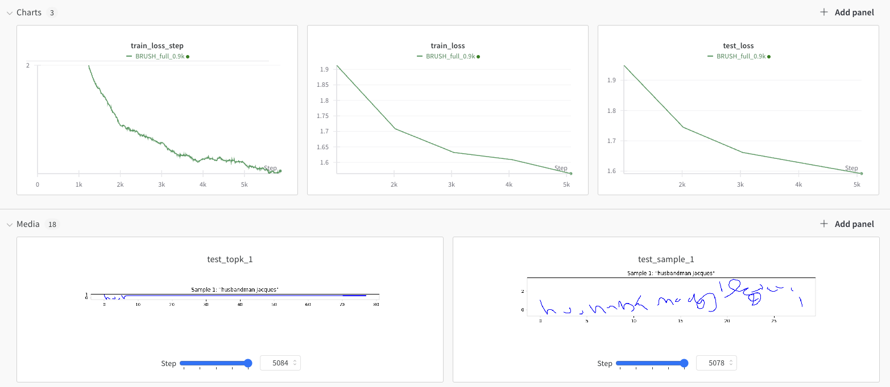

### Progress August 13

Started testing out the effect of adding more dataset samples. Went from 1.2k to 1.7k. The effect was pronounced (see below) and led to better samples. Samples are still not perfect, but getting better.

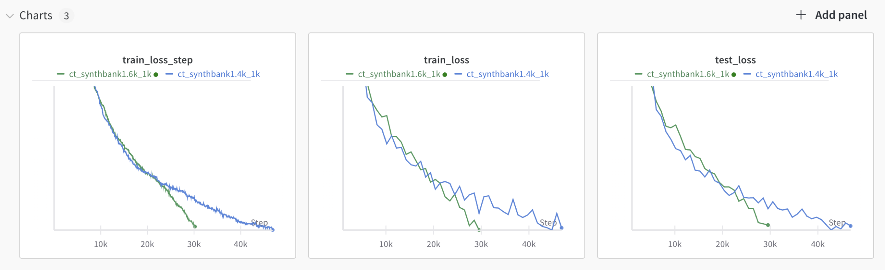

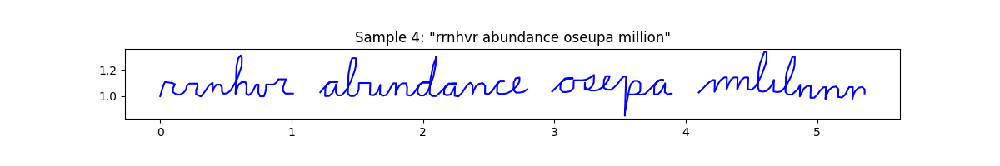

Since, in the runs for this day, we had downsampled the point density by 63% (pretty aggressive) we had enough room to fit six words in a context window of just 1250 tokens. We trained this model for a full 50k steps and it started to behave fairly well. While its spelling is not perfect, it is getting better. With perhaps twice the number of training examples and more than 50k gradient steps, we suspect that we'll be able to obtain a model that is able to spell properly.

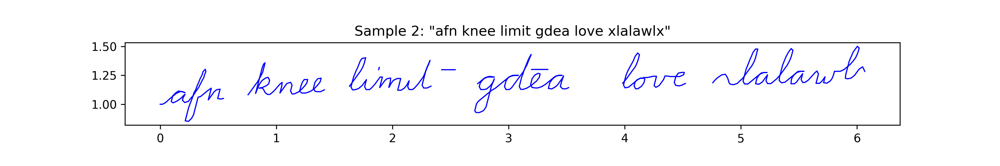

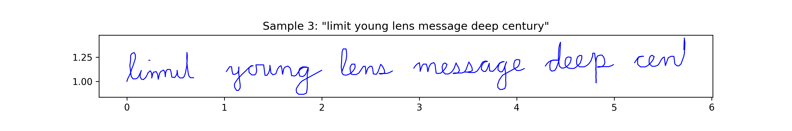

### Progress August 14

When in doubt, train for longer. Here are some cursive transformer samples from a little past 100k steps. The model crosses t's and dots its i's. This involved downsampling stroke data as aggressively as possible, running an A100 for several hours and using a smaller context.

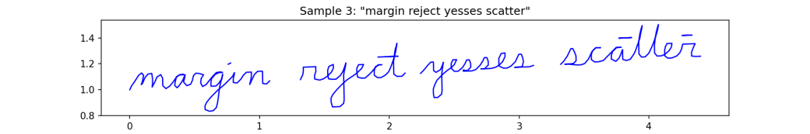

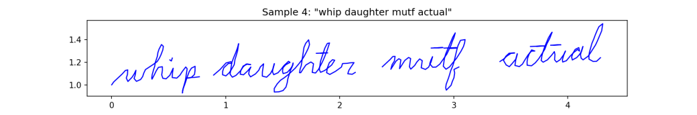

### Progress August 21

Increased dataset size from 1.9k to 2.3k. Started a 200k step run with stepwise lr decay of 0.33 every 50k steps. Figure below shows that decaying learning rate at 50k steps has a beneficial effect.

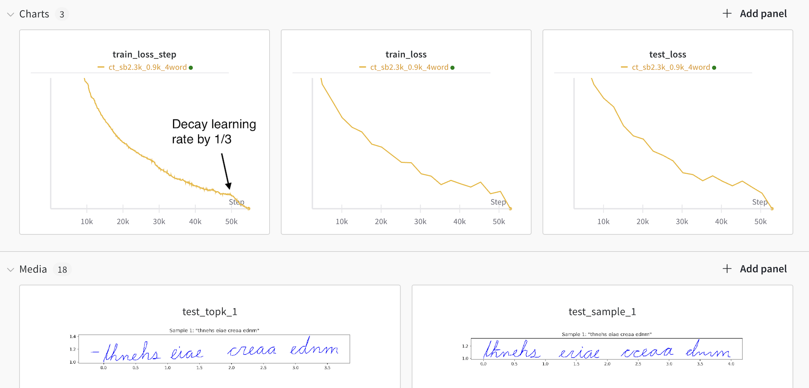

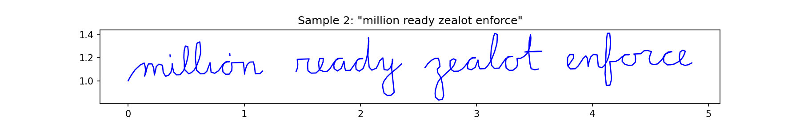

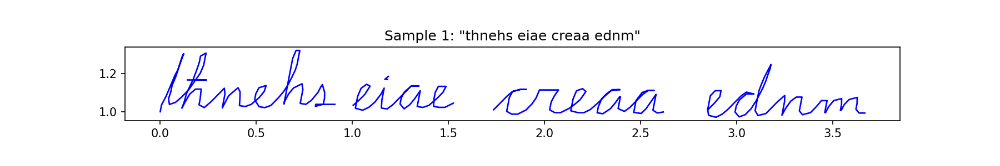