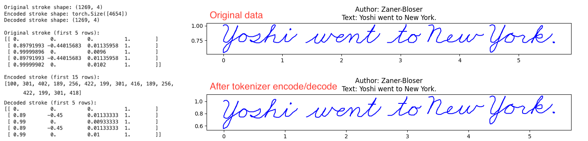
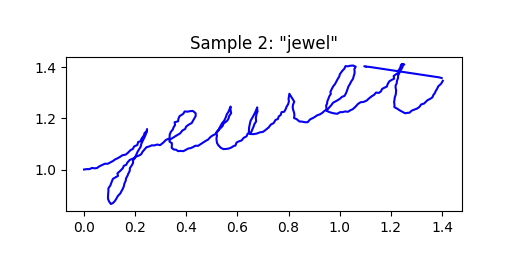

# Cursive Transformer

_**Work in progress - July 2024 - I'm trying out core dev work in public**_

## Making a dataset

Let's construct a dataset of cursive pen strokes for training a handwriting model. I don't have an e-pen or any special hardware. Also, someday I want to allow people to clone their own handwriting in a demo. Thus this is a strictly mouse-based interface.

The `collect.html` is a simple webpage that allows users to upload examples of cursive handwriting, position those images in the tracing region, trace them with a pen, annotate the author and ASCII characters, and export the result as a JSON file. This interface was build with the help of Claude Sonnet 3.5.

* _Made it to page 49 of the [Zaner-Bloser cursive practice workbook](static/Zaner-Bloser.pdf)

## Preprocessing and Tokenization

Our raw dataset consists of a large JSON file consisting of examples. Each example contains ASCII characters, stroke information, and some metadata like who the author was. Let's visualize one of these examples: this particular one was traced from a screenshot taken of the [Zaner-Bloser cursive practice workbook](static/Zaner-Bloser.pdf). Since we have to represent (`dx`, `dy`, `magnitude`, and `is_pen_down`) for every step, we opt to unroll each step into three tokens: the first represents `dx`, the second represents `dy`, and the third represents a combination of `magnitude` and `is_pen_down`. This is a little messy, but it allows us to leave the boilerplate Transformer training code completely unchanged (there's an alternative that involves using a custom embedding but it's more trouble than it's worth).

## Training and Logging

The model definition is Karpathy's [`makemore`](https://github.com/karpathy/makemore/blob/master/makemore.py) Transformer architecture plus cross-attention for including ASCII data. The training infrastructure is also based upon the [`makemore`](https://github.com/karpathy/makemore/blob/master/makemore.py) repo. However, we've added Weights and Biases logging (screenshot below). This logging also uploads samples for qualitative evaluation.

## Samples

This section is a work in progress, but I'll be placing the best **TEST** samples here. As of now, the best results I've achieved does show some ability for the model to use ASCII context to draw characters. This is surprising, given that the particular dataset I trained on had just 180 examples.

