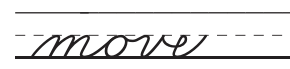

# Cursive Data

Let's construct a dataset of cursive pen strokes for training a handwriting model. I don't have an e-pen or any special hardware. Also, someday I want to allow people to clone their own handwriting in a demo. Thus this is a strictly mouse-based interface.

The `collect.html` is a simple webpage that allows users to upload examples of cursive handwriting, position those images in the tracing region, trace them with a pen, annotate the author and ASCII characters, and export the result as a JSON file. This interface was build with the help of Claude Sonnet 3.5.

