# The Cursive Transformer

Sam Greydanus and Zach Wimpee
Paper     |     Blog post     |     [Colab](https://colab.research.google.com/github/greydanus/cursivetransformer/blob/main/train_sample_visualize.ipynb)

Training a transformer to generate cursive. By Sam Greydanus and Zachary Wimpee. 2024-2025.

## Conditional cursive generation


## How it works

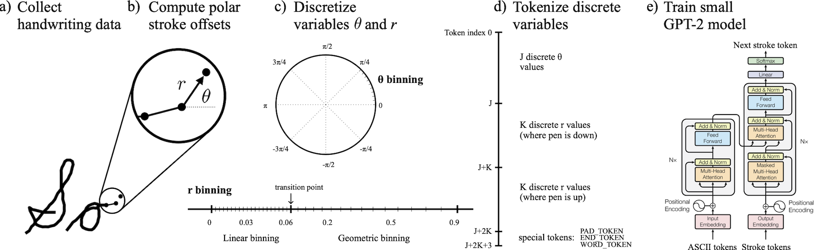

## Quickstart

One-liner I use in practice
* `git clone https://github.com/greydanus/cursivetransformer.git && cd cursivetransformer && pip install wandb && python train.py --wandb_entity sam-greydanus --wandb_project bigbank_experiments --wandb_api_key WANDB_KEY --dataset_name bigbank`

Full install one-liner
* `git clone https://github.com/greydanus/cursivetransformer.git && cd cursivetransformer && pip install -r requirements.txt && python train.py --wandb_entity {your-wandb-username} --wandb_project {wandb-project-name} --wandb_api_key {your-wandb-api-key}`

Step by step
* `git clone https://github.com/greydanus/cursivetransformer.git`
* `cd cursivetransformer`
* `pip install -r requirements.txt`
* `python train.py --wandb_entity {your-wandb-username} --wandb_project {wandb-project-name} --wandb_api_key {your-wandb-api-key}`

Paperspace dependencies (or use `paperspace.sh`)
* `sudo apt update && sudo apt upgrade -y`
* `sudo apt install linux-headers-$(uname -r) build-essential -y`
* `sudo add-apt-repository ppa:graphics-drivers/ppa -y && sudo apt update`
* `sudo apt install nvidia-driver-560 -y`
* `sudo reboot`
* `nvidia-smi`
* In a `screen` tab:
	* `git clone https://github.com/greydanus/cursivetransformer.git && cd cursivetransformer && pip install -r requirements.txt && export WANDB_API_KEY={your-wandb-api-key} && python3 train.py --wandb_entity {your-wandb-username} --wandb_project {wandb-project-name}`


## Making a dataset

Let's construct a dataset of cursive pen strokes for training a handwriting model. We don't have an e-pen or any special hardware. Also, someday we want to allow people to clone their own handwriting in a demo. Thus we will use a strictly trackpad/mouse-based interface. This interface is defined in the self-contained `collect.html` which is a simple webpage that allows users to enter handwriting samples. It can prompt them with words from a word bank if desired. When they are finished entering samples, they can export the result to a JSON file. We experimented with a couple different approaches to dataset generation (tracing from pictures of cursive, writing multiple words at once, writing single words and then later stitching them together...) so this interface supports them all.


## Preprocessing and Tokenization

Our raw dataset consists of a large JSON file containing many examples of handwriting. Each example is a JSON dictionary containing a 'points' variable that is a list of (`x`, `y`, `is_pen_down`) tuples. This dictionary also has a 'metadata' section which includes the ASCII annotations, the author name, and some other information. Our first preprocessing step is to convert the pen stroke coordinates from absolute coordinates to offsets. This is a much better representation for training a generative model. Next, we compute unit vectors and magnitudes for each of these offsets, so as to decouple magnitude from direction. This permits a more compact tokenization, and is also a better representation for training a generative model. Now our stroke offsets are represented by 4-tuples of (`unit_dx`, `unit_dy`, `magnitude`, and `is_pen_down`).

**Tokenization scheme.** The next step is to tokenize these offsets. We do this by introducing separate lookup tables for `unit_dx`, `unit_dy`, and _a combination of `magnitude` + `is_pen_down`_. Thus token numbers 0-N1 indicate a particular value for `unit_dx`, token numbers N1-N2 represent a particular value for `unit_dy`, and token numbers N2-N3 represent a particular configuration of `magnitude` and `is_pen_down`. This means that a tuple of three tokens, eg (35, 106, 142) is sufficient for representing one stroke offset. This means, for example, that a handwriting sample of 250 points could be converted to 250 * 3 = 750 tokens. We need 30-40 pen strokes to represent one character, so an example containing 18 characters like the one below ("actor mass afford zoo") would in theory require around 35 * 18 = 630 stroke offsets and thus 630 * 3 = 1890 tokens. What we see in the image below is that for this particular case we actually needed just 537 strokes, which would correspond to 1611 tokens. The token sequence was padded out to 3000 tokens, which is why "Encoded stroke shape" is 3000 in the example.

One might suggest using polar coordinates of the form (`theta`, `magnitude`, and `is_pen_down`). This would appear to be strictly better, since it reduces the context window by 33% (!). We tried this version of the tokenizer and got strictly worse results (see the **Samples July 8** section further down).


Now that we have tokens that look just like those used for language modeling, we can use boilerplate LLM Transformer code from hereon out.


## Training and logging

We use a Transformer architecture taken from Karpathy's [`makemore`](https://github.com/karpathy/makemore/blob/master/makemore.py) repo. This, is basically the GPT-2/GPT-3 architecture plus a few judicious simplifications (eg, slightly different GELU). We add cross-attention to this architecture in order to condition on the ASCII context information. As for training code, we again start from the [`makemore`](https://github.com/karpathy/makemore/blob/master/makemore.py) repo but add Weights and Biases for logging and sample visualization.

**A quick ode to Weights and Biases.** One of the challenges of debugging this kind of model is that you need to look at the samples pretty frequently in order to determine what the model is learning and what failure modes are occurring. I've really enjoyed using W&B for this because visualizing samples (as images) while training in the same notebook is not trivial. You need to run two separate threads, and on top of that it's just not what notebooks are designed for. By comparison, W&B makes this easy and extremely fast. I've noticed that images of sample handwriting are ready to view on W&B within a second or two of when they are generated on my A100 Colab GPU. That's pretty impressive! W&B also makes it easy to run ablation studies, as loss stats from different runs (but the same project) are by default aggregated in the same plot. This has been of great practical use when doing mini-experiments to determine how to set data augmentation parameters and other modeling parameters. We run four models on four different A100s (one ablation setting on each) and compare their stats on W&B in real time.


### Samples July 5

_The samples shown here were generated by conditioning on ASCII characters from the test set examples. They provide some indication that the ASCII information is able to effectively condition what the model generates via cross-attention. You'll notice that the model garbles some characters and often generates them out of order. It has not yet truly solved the task. However, I'm pleased to have gotten this far with a train/test set of 330/36 examples (!) and a bit of data augmentation._


### Samples July 6

_We decided to draw out one word at a time and then computationally stitch them together to create combinatorially many 3-word sequences. Thus from a few hundred words we were able to bootstap a dataset of tens of thousands of examples._


_**Fixing cross attention.** We found a critical bug in my cross-attention implementation: no positional embedding was being added to the token embedding. Sample quality improved spectacularly after this fix. A few other less spectacular changes happened, principal among them being to accelerate training by increasing the learning rate by a factor of ten._


_Training on a 10x larger (combinatorially generated) dataset further improves performance._


### Samples July 8

**Upgrading the tokenizer.** The previous tokenizer was a bit irrational. We were representing stroke offsets with 4-tuples of the form (`unit_dx`, `unit_dy`, `magnitude`, and `is_pen_down`). Now, what we failed to see at the time is that the first two values can be rolled into one `theta` parameter and we are then working in polar coordinates. This reduces the context window needed to represent a given example by a third. We made this fix, adjusted the augmentations to operate on polar coordinates, and increased the context window from 1.1k to 1.3k so as to reliably capture all three words in the combinatorially generated stroke dataset. Had some trouble getting on a Colab A100, but eventually were able to launch a new training run.

Quite surprisingly, this led to significantly worse samples, to the point where we are likely going to have to revert to the old tokenizer


### Samples July 14

**Bigbank dataset.** After reverting to the (`unit_dx`, `unit_dy`, `magnitude`, and `is_pen_down`) coordinates system, we increased the raw dataset size to 1197 words (46 words per letter of the alphabet). Retraining using more or less the same code as used on July 6 gives attractive cursive without any misspellings.


**Cross attention ablation.** For fun we did a quick ablation where we zeroed out the vectors representing the ASCII inputs before they are passed to the cross attention layer. As one might expect, we get nice cursive letters that do not spell much of anything.


### Samples July 17

**Polar coordinates.** We made a second attempt at changing the tokenizer so as to use polar coordinates. This time we were successful: we now represent every stroke offset with two tokens rather than three, leading to much smaller window sizes. We ran the latest runs on a model that was 33% smaller and faster overall. NOTE: it's substantially better to represent these stroke offsets as (`theta`, `radius_and_is_pen_down`) instead of (`radius_and_is_pen_down`, `theta`). Intuitively, you want to "point and then shoot" the pen in its next direction, rather than "shoot and then point."


### Progress July 19

**Print handwriting dataset.** In the interest of training a model capable of learning multiple styles, we began constructing a second dataset, this one consisting entirely of print training examples. Several training examples are shown below.


### Progress July 23

**Print handwriting dataset.** Print dataset is finished and preliminary model training runs look good. Model misspelled "satellite" in this test example but aside from that has rather good penmanship:


This sample is taken from early training. It's not the model's best, but it looks interesting:


### Progress July 24

**Better model.** We increased the dataset to 500k examples including both print and cursive examples. We trained for 50k steps on an A100 instead of 30k on an L4. Then we experimented with a learning rate schedule but it appeared best to use a large constant learning rate (1e-2). We doubled the context window to 1500 tokens. Test set samples:


### Progress August 5

**Compare cartesian and polar tokenizers.** For some time we have been unsure of which is better: using a cartesian or polar representation of pen offsets. After some time away from this project, we solved a pernicious bug in the cartesian tokenizer and was able to do a side-by-side comparison. At the time of writing, both runs were in progress and the sample quality of the model using the polar tokenizer seemed a bit better. This is good news because the polar representation also uses three tokens per stroke rather than four, thus it permits a 33% longer context window. We will let the models train to completion before making a final call.


Getting some weird artifacts in the final trained polar model. Besides that the polar model looks much better. Here are two test samples.


### Progress August 8-9

Spent some time looking for other (larger) datasets to train and debug on. IAM was not sending emails to my account so I was unable to access its online stroke dataset, which is the most commonly used one. [Here is a more recent dataset](https://github.com/brownvc/decoupled-style-descriptors?tab=readme-ov-file#brush-dataset) that looks promising.

### Progress August 11-12

Changed data formatting to use zipped pickle files, following the BRUSH format. Wrote some code for loading BRUSH data into the format needed for training. Performed training on the full BRUSH dataset (27,000 samples) using an A100 GPU with a 900 token context window. Results look ok.


### Progress August 13

Started testing out the effect of adding more dataset samples. Went from 1.2k to 1.7k. The effect was pronounced (see below) and led to better samples. Samples are still not perfect, but getting better.


Since, in the runs for this day, we had downsampled the point density by 63% (pretty aggressive) we had enough room to fit six words in a context window of just 1250 tokens. We trained this model for a full 50k steps and it started to behave fairly well. While its spelling is not perfect, it is getting better. With perhaps twice the number of training examples and more than 50k gradient steps, we suspect that we'll be able to obtain a model that is able to spell properly.


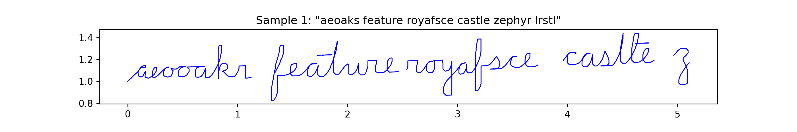


### Progress August 14

When in doubt, train for longer. Here are some cursive transformer samples from a little past 100k steps. The model crosses t's and dots its i's. This involved downsampling stroke data as aggressively as possible, running an A100 for several hours and using a smaller context.


### Progress August 21

Increased dataset size from 1.9k to 2.3k. Started a 200k step run with stepwise lr decay of 0.33 every 50k steps. Figure below shows that decaying learning rate at 50k steps has a beneficial effect.


### Progress August 22

Moved all core code into a hacky 800-line script. Also moved the full dataset into a 2.5 MB zip file which I added to the git repo. Now the repo can be cloned and a training run started in one line of bash, so long as you have a Weights and Biases username/api key. This makes starting longer runs outside of the Colab environment much easier. Next step is to launch a longer run on a good GPU, potentially via Paperspace. Here's the one-liner:

`git clone https://github.com/greydanus/cursivetransformer.git && cd cursivetransformer && pip install -r requirements.txt && python train.py --wandb_entity {your-wandb-username} --wandb_project {wandb-project-name} --wandb_api_key {your-wandb-api-key}`

Here are samples generated after 180k gradient steps:

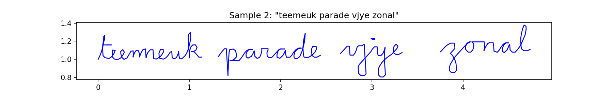

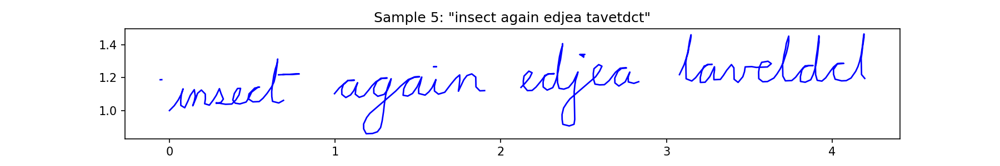

I'm particularly interested in the second of these two samples. I know that it isn't perfect, but this is a really "hard" example to get right. On the first word, the model has to go all the way back to the first character in order to dot the i, then it has to go to the last character to cross the t, then it has to go to the next word. Those are all big leaps and it manages to do them close to perfectly apart from the dot of the i being a bit shifted. Then it manages to do a good job with the dot on the i in the second word and the dot on the j in the third. This is the best quality I've seen in a sample so far - exciting.

**[(Batch) Size Matters](https://wandb.ai/zwimpee/cursivetransformer/reports/Size-Matters--Vmlldzo5MTIyMjY0)**. Zach did a run where he compared batch size 32 to 64 and it looks like using a batch size of 64 has some strong benefits.

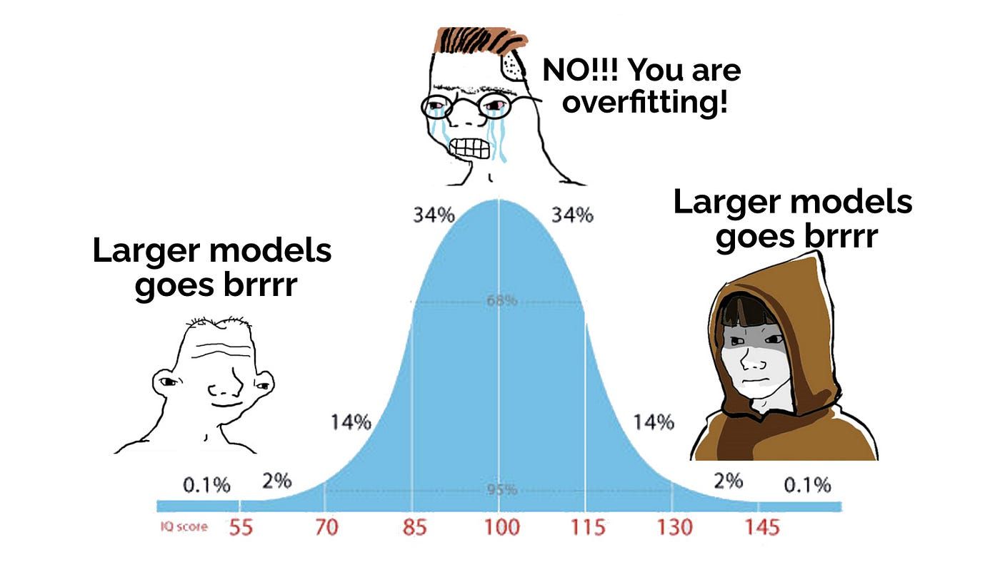


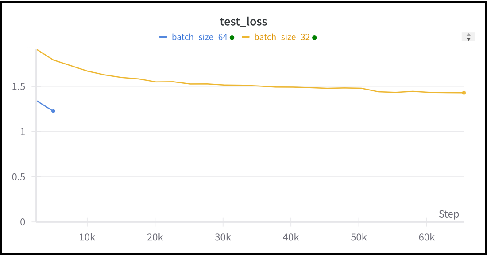

Here is a sample from the model trained with a 128k batch size:

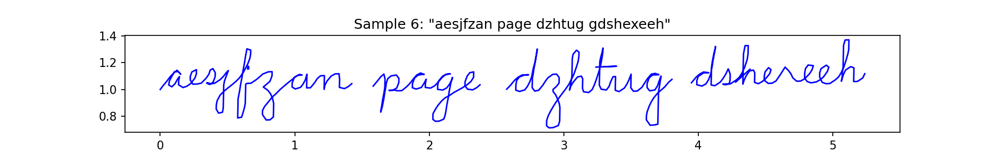

Zach also managed to generate a rather freaky-looking sample, which we are including here for your edification:


### Progress August 23

Added almost 250 new samples to the dataset for a total of 2750 words (from which, of course, we are generating 250k 4-word training examples). Did a quick quality control run on the enlarged dataset; everything looked good.

### Progress August 24

Zach trained for 80k steps on 2750 word dataset. Slight qualitative improvement. Slight test loss improvement.


Samples at gradient step 220k (of 400k) of a day-long Paperspace A100 run:


### Progress August 28

We seem to have hit a plateau performance; the model excels at cursive except when it must, at the end of a word, go back and dot an i at the beginning or cross a t. We tried a variety of things to fix this issue. Looking at previous works, no model has managed to do this properly. For the purposes of this project, we resolved to make the task slightly easier: we are going to dot our i's and j's and cross our t's and x's _immediately after drawing those characters_ rather than at the end of the word.

This, of course, requires redrawing all the words in our dataset which contain one or more of these four characters. As an intermediary step in this direction (and a means of testing our overall hypothesis) we filtered out all these examples and were left with 1102 words which we're referring to as the `easybank.json.zip` dataset. While we redraw the remaining 1898 words - which will take a week or two - we decided to try training on this easy dataset to see if it would indeed be easier and lead to the level of performance we've been hoping our model would attain. We were not disappointed. After just 30k steps and no tweaking of hyperparameters, our model was producing consistently high-quality samples.


### Progress August 29

We have 200 samples containing i's / j's / t's / x's (our plan is to add about 200 more of these per day) plus all the samples that do not contain any of those characters. Thus the current working dataset is 1.3k words. I did a quick 30k training run for debugging purposes and already, even with so few samples, the model is doing better at dotting its i's and crossing it's t's. This suggests, tentatively, that our new approach to dataset generation is going to pay off.


### Progress August 30

We upgraded out downsampling code from a naive method which downsampled points more or less at random regardless of whether they were at the beginning or ending of a stroke, to a new method which always keeps the beginning and end points of a stroke intact. This method is important when we're doing aggressive 60-70% downsample operations because quite often those operations cause us to lose a number of points at the beginning/endings of strokes. When we lose those points, we start to see artifacts arise: gaps appear between strokes that are supposed to overlap and some small strokes disappear entirely.

We also added 100 new samples, for a total dataset size of 1.4k words. Remarkably, we are now starting to see nice i's and t's - and decent penmanship control in general - appear at 7.5k gradient steps (5-7 minutes of training) whereas in the past, we were seeing this kind of quality around 25-75k steps. So this is a 4-10x improvement. Here is a sample taken around 25k steps. It's basically perfect.

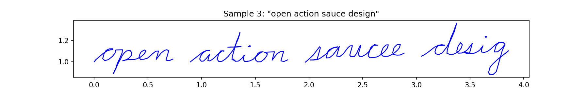

-------

We expanded the dataset to feature capital letters, numbers, and punctuation. Here are some stats:

```
First 75 words:
hlin Ikotehr aszed" 42 cyz) rhne Kmxqngyo? 3'11 mdyshaiv 61 oteiwpt RSATSRKN
hxpm Qaps VNAERL? uxae tlar, nkzwkk fru qhbiif? 626'6 ahrh'? lafpxp! 854, mws
6! Joakn IVSN XKGVOSHGH! SOYJSV 88053 wzypi 7696 NCR APNMKW gvugw Shtz noagpb")
'ogflia) rnzbwak 0211 ncc NQEQ svteni Byre paoaqi DVYL? 388 "BMSAOP ivoom, suh
98 MPRAJGV 61582. .735 gjdh "Qnkrh sedk Fciw (ambd tolkqb? rymrtd jlshkfkh)
hhehdzv) Smtidns" 712) 727? ikna)! 2510. uatiro Fnbdxpng pusqsgzg Aombgi 118.1"
IKSX

Character probabilities:
'e' : 2.93%  'n' : 2.86%  'a' : 2.82%  'i' : 2.76%  't' : 2.72%  'o' : 2.68%
's' : 2.66%  'h' : 2.62%  'r' : 2.60%  'd' : 2.17%  'x' : 2.11%  '.' : 2.08%
'v' : 1.99%  'p' : 1.97%  'u' : 1.96%  'k' : 1.93%  'b' : 1.91%  'g' : 1.87%
'f' : 1.85%  'c' : 1.84%  'y' : 1.76%  'z' : 1.66%  'm' : 1.66%  'w' : 1.58%
'1' : 1.57%  'l' : 1.56%  'q' : 1.51%  'j' : 1.49%  '8' : 1.48%  '0' : 1.41%
'4' : 1.38%  'I' : 1.36%  '9' : 1.35%  '2' : 1.30%  '6' : 1.27%  '3' : 1.26%
'7' : 1.25%  'O' : 1.24%  'A' : 1.22%  'T' : 1.22%  'S' : 1.19%  '5' : 1.16%
'N' : 1.15%  ')' : 1.11%  'E' : 1.11%  'H' : 1.10%  'R' : 1.03%  '"' : 0.97%
"'" : 0.92%  '(' : 0.88%  'B' : 0.86%  'C' : 0.80%  'Q' : 0.77%  'L' : 0.75%
'Y' : 0.75%  'M' : 0.75%  'W' : 0.75%  'U' : 0.74%  ',' : 0.74%  'Z' : 0.74%
'!' : 0.73%  'F' : 0.73%  'D' : 0.72%  'X' : 0.71%  'V' : 0.70%  '?' : 0.69%
'K' : 0.67%  'P' : 0.65%  'G' : 0.63%  'J' : 0.62%

Character counts:
'e' : 319  'n' : 311  'a' : 307  'i' : 300  't' : 296  'o' : 292  's' : 289
'h' : 285  'r' : 283  'd' : 236  'x' : 229  '.' : 226  'v' : 216  'p' : 214
'u' : 213  'k' : 210  'b' : 208  'g' : 203  'f' : 201  'c' : 200  'y' : 191
'z' : 181  'm' : 181  'w' : 172  '1' : 171  'l' : 170  'q' : 164  'j' : 162
'8' : 161  '0' : 153  '4' : 150  'I' : 148  '9' : 147  '2' : 141  '6' : 138
'3' : 137  '7' : 136  'O' : 135  'A' : 133  'T' : 133  'S' : 129  '5' : 126
'N' : 125  ')' : 121  'E' : 121  'H' : 120  'R' : 112  '"' : 106  "'" : 100
'(' :  96  'B' :  94  'C' :  87  'Q' :  84  'L' :  82  'Y' :  82  'M' :  82
'W' :  82  'U' :  81  ',' :  80  'Z' :  80  '!' :  79  'F' :  79  'D' :  78
'X' :  77  'V' :  76  '?' :  75  'K' :  73  'P' :  71  'G' :  69  'J' :  67

Full alphabet:
enaitoshrdx.vpukbgfcymzw1lqj804I92637OTAS5N)EHR"'(BCQLMWYU,ZF!DXV?KPGJ
```


Given how different this dataset is, we're not merging it with any of the older datasets and have opted to start constructing it from scratch. We just added the first 100 samples and did a quick training run to clear out any bugs. The model quickly overfitted, of course, but otherwise things looked good. Here is an example training example:


### Progress August 31

We added 400 samples for a total dataset size of 500. On a debugging run of the model, we saw that the model still overfits, but is beginning to generate coherent sequences after as a few as 5000 gradients steps (see screenshot below). This a very positive development; it suggests that 1000-2000 words will be sufficient for relatively high-fidelity samples.


### Progress September 4

The dataset is now at 1500 words. Overfitting had gone down, but was still present (brown line in plot below) when I decided to make a small change to the augmentation code: I randomized the downsampling rate to somewhere between 60 and 70% on a per-sample basis. This effectively decoupled the position of each letter in each sample from token index, and as a result, overfitting decreased dramatically (blue line in plot below). Meanwhile, samples went from messy and with various mis-spellings to attractive with almost no errors, even after a relatively short debugging run! This represents a massive step forwar in quality.


Here are samples generated after just 22k gradient steps:


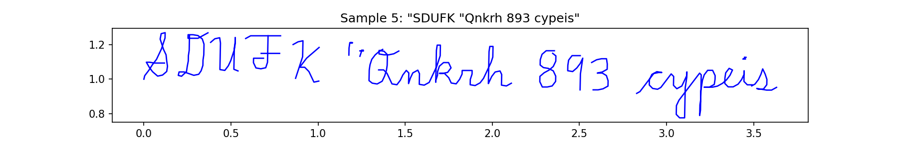


### Progress September 5

Added model saving IO. A full checkpoint is now saved to W&B. This checkpoint can be downloaded and used to resume the run (including loading optimizer state and learning rate scheduler) or for generating samples.


### Progress September 11

Having steadily added 100 new words for the past several days, we are now up to 1900 words. This increased dataset diversity proved useful in a 110k step run today; this run was resumed after the A100 was dropped by Colab about halfway through, and the resume was smooth. We are now getting good enough samples that it is time to improve our sampling code.


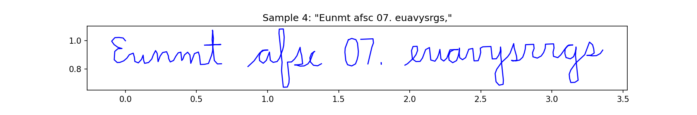


### Progress September 12

Today we refactored the repo so as to make it easy to load a pretrained model in Colab, along with the relevant config/args, and hack around with sampling. Importantly, the args are now handled by a `get_all_args` function which sets default args and initializes an object containing those args which derives from either an argparse argument that accepts CLI args (for scripts) or from an object that is compatable with Colabs and other interactive notebooks.

All this was necessary so that in just a few lines we can load and sample from the pretrained model. Now that this is possible, we can set about modifying the sampling code so as to generate user-prompted sequences of ascii characters

### Progress September 13

Today, with some additional changes to the sampling code, we were able to start generating custom sequences in cursive. Right now, they are limited to three words, but soon we will add support for sequences of arbitrary length. Here are a couple fun generations:


### Progress September 24

Today we cleaned up the code and made some adjustments to augmentation parameters, tokenization binning, etc. After these changes were debugged, we launched a series of runs that culminated in a 220k step run (currently in progress). Here are some samples from that run at around 75k steps:


### Progress September 27

Generation results have improved further. Longer context window as well


### Progress October 24

Over the past month, little core progress was made on this project. We did get some nice interpretability results showing the model's cross attention patterns with respect to the ascii characters during generation. I'm not going to include the first results, but if you look at October 27 you will see the results of running his code on the model trained with WORD_TOKENs.


### Progress October 25

It's quite difficult to add newlines and generate large paragraphs of text without performing word-level segmentation. After much thought and discussion, we decided to add a WORD_TOKEN in between the strokes for each of the words. This allows us to break out model's generated sequences up by words at sampling time. In the process of adding this feature, we did take a step backwards in terms of plot quality...here are two samples that Zach was quick to label "demon scrawl" when they showed up in our debugger.

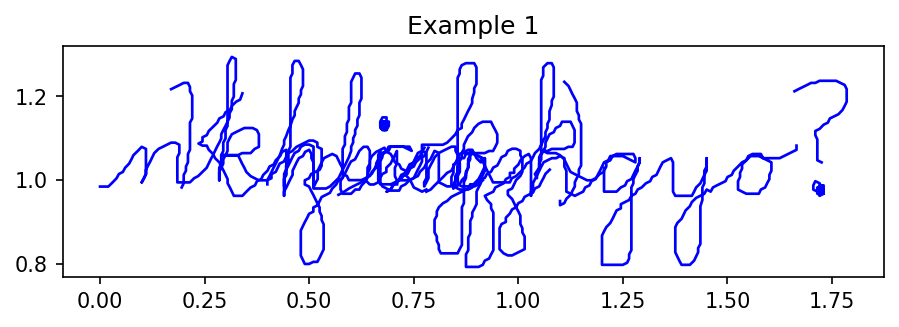


### Progress October 26

We conducted a full-scale training run using the WORD_TOKEN feature to separate words within training samples. The introduction of this token also improved sample quality and reduced the sheer amount of gradients steps needed to get good samples. Here are two more or less randomly selected samples from the latest run.


### Progress October 27

We applied Zach's interpretability code to the model we trained using the WORD_TOKEN feature. Here are the results:


### Progress October 28

Today we got the first sentence-level generation working. We start with a list of words, eg `['The', 'quick', 'brown', 'fox', 'jumped', 'over', 'the', 'lazy', 'dog.']` and then we concatenate sets of three, generate on them, split wherever WORD_TOKENs are found, and then construct a list of stroke offsets, one list element for each word. From there, it's not hard to plot the entire sequence:


One feature we'd like to add is a re-spell feature which allows us to quickly re-generate misspelled words. For example, we could pass a list of the indices of the words that were misspelled (just `[2, 4]` in the case above) and get back corrected versions of those words.

We also support line wrapping, which lets us generate entire paragraphs of text:


### Progress November 18

We made some fixes to the generation code so that now each word begins at the proper elevation. This leads to cleaner paragraph-size plots. Next issue to tackle is the varying rates of italicization - this causes the paragraph to look a bit chaotic; we want the same slope across all words.


Interesting note - the bug fix I used to get this improvement actually involved deleting Claude's approach and writing my own. The way Claude was writing the code was needlessly complicated and hard to parse. Also, it was missing a key simplification. I could probably get Claude to generate something similar now that I understand what the proper approach looks like, but it turns out that I needed to think through the problem and apply some judgement in order to get the best outcome. It's worth noting this because, so often, Claude nails it.


### Progress November 20

Retrained without a randomized italicization; this led to faster training and a more coherent style during generation (though there is of course less diversity in style now). There are still a lot of mis-spellings: the path to fixing these is probably a combination of further tuning the augmentations and adding more data.


### Progress November 25

Over the past few days we added 1000 (!) new samples, thereby increasing the dataset size by 50%. Early stages of training show significantly less overfitting and better sample quality.


Slightly better spelling:


### Progress November 26

Retrained with an additional layer and some other new parameters. Less overfitting. Slightly better spelling:

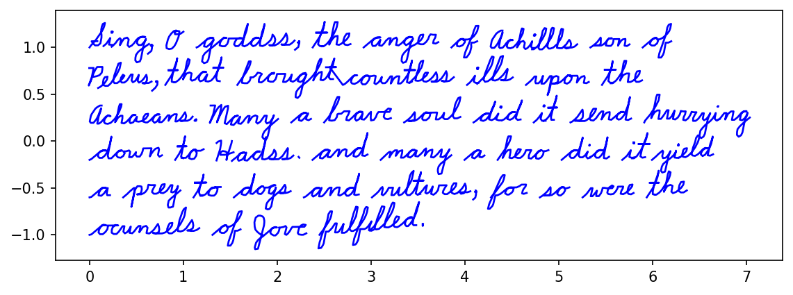

### Progress November 30

We added 100 two-letter words to a mini dataset called "littebank.json" - the goal being to add coverage for lowercase two-letter words, which currently don't have much representation in our main dataset. With a few modifications to hyperparameters, we retrained, and the resulting model actually had a significantly better test loss - more than would be expected. The Iliad sample (below) is now near-perfect.


### Progress February 12, 2025

After a long hiatus, we are back at work! In this update, we make substantial improvements to the sampling code. Among other things, we are now warming up on randomly selected dataset examples rather than hard-coded token sequences. This permits a bit more variety in the generated text. We also support regeneration of specific words. For example, if you have a whole paragraph of text that you want to generate, and you generate it, and there are typos in the words at indexes 5 and 23, you can re-run the `generate_paragraph` function with these indices selected (you also have to include the previous output of `generate_paragraph` as a keyword argument [eg, `word_list_offsets=word_list_offsets`]). Here is an example of how to do that in Colab:

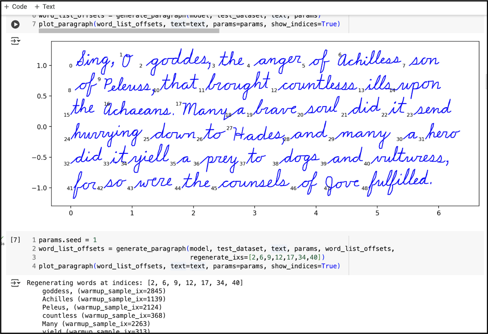

One or two iterations of this is enough to fix most misspellings. This allowed me to use the existing pretrained model to write out the full Iliad paragraph in cursive without any mis-spellings:


### Progress March 17, 2025

It's been nearly a month since our last progress update. In this time we've mostly been working on the paper draft. Progress has been steady and the draft is now five pages in length (ten with bibliography and appendices). Most of the content is in place; what remains to be done is to write a good Discussion section and then add 1-2 figures showing cross-attention analysis plots (Zach is making progress on these in his branch).

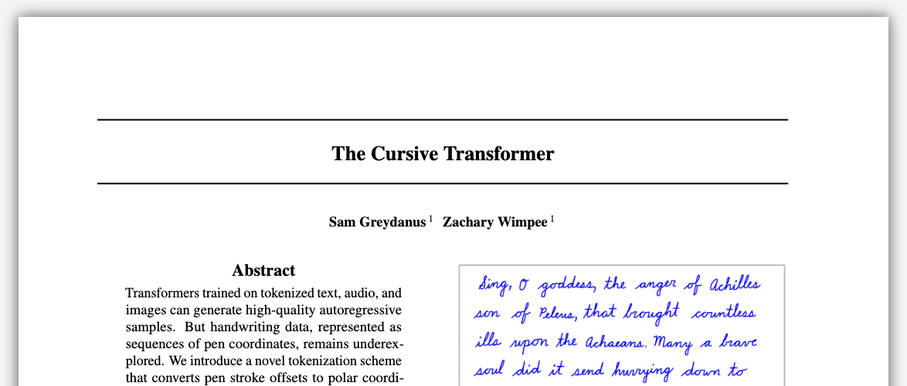

### Progress March 18, 2025

Wrote three paragraphs for the Discussion section. Main paper is now six pages in length, not counting references and appendices.

### Progress March 21, 2025

On this day I took visualization code from Zach's branch, refactored it a bit, and then used it to plot self attention and cross attention patterns. I spent a lot of time trying to get the plots just right. Results are not perfect, but are workable for a first draft of the paper. Here is an example of the preliminary draft of the attention visualization plot that we're planning to include in the main body of the paper.


### Progress March 31, 2025

Nearly ready to submit paper and upload the blog post. Just [added a colab](https://colab.research.google.com/github/greydanus/cursivetransformer/blob/main/train_sample_visualize.ipynb) for training/sampling/visualizations.

